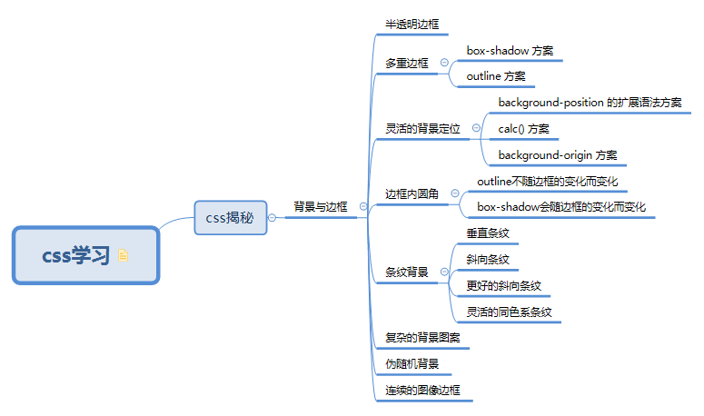

<!--
 * @Descripttion: 🐉
 * @Author: xinxin
 * @Date: 2020-02-22 12:28:43
 * @LastEditTime: 2020-02-22 14:48:14
 -->
## 知识集锦
👉我会不断更新知识，希望能帮助一些人
## 主要内容
👉目前在整理css系列问题，结合在开发中遇到的问题，提出解决方案。为了能够高效率的开发项目，在遇到许多坑后，对其进行整理

## 计划安排
👉前期内容可能杂而乱，但是我会不多优化完善。如果有兴趣的伙伴，可以提交自己的一些技巧，心得知识等。
## 最后
👉作为一名前端人员，我和我一起同路的人，都在不断积累沉淀自己的知识，希望我们能在未来的道路都能开开心心学技术，认认真真完成工作 
